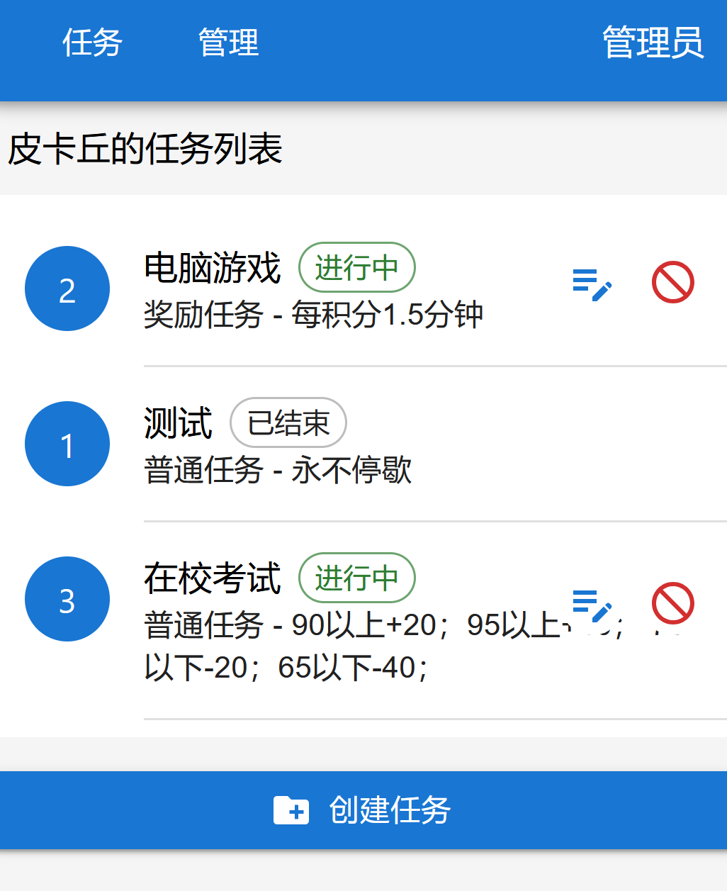
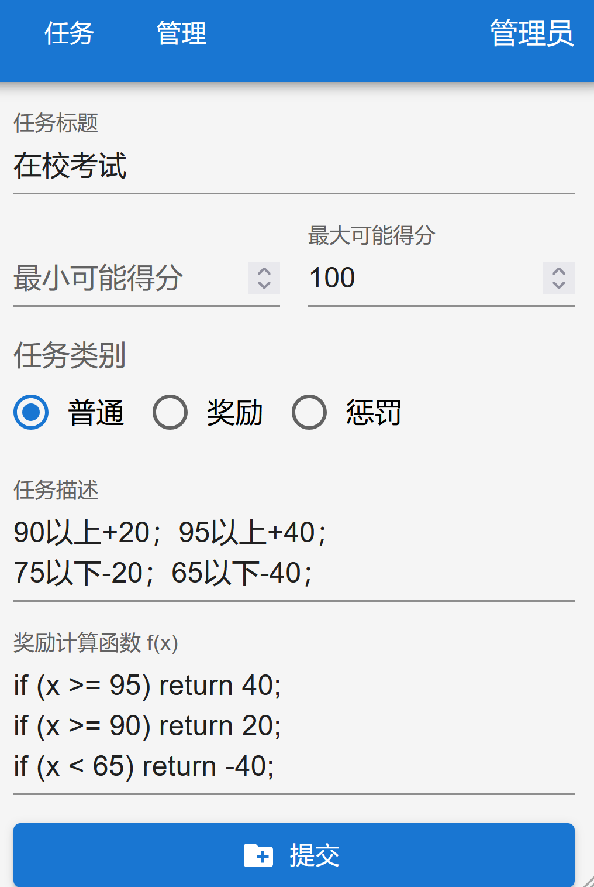
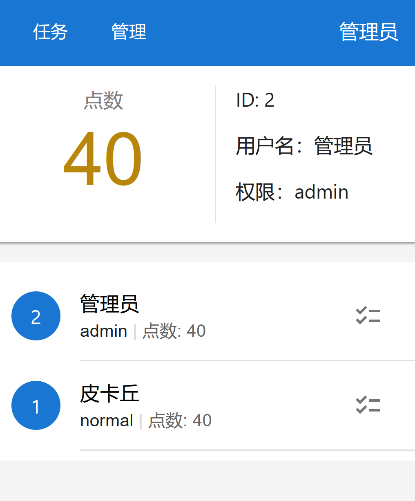
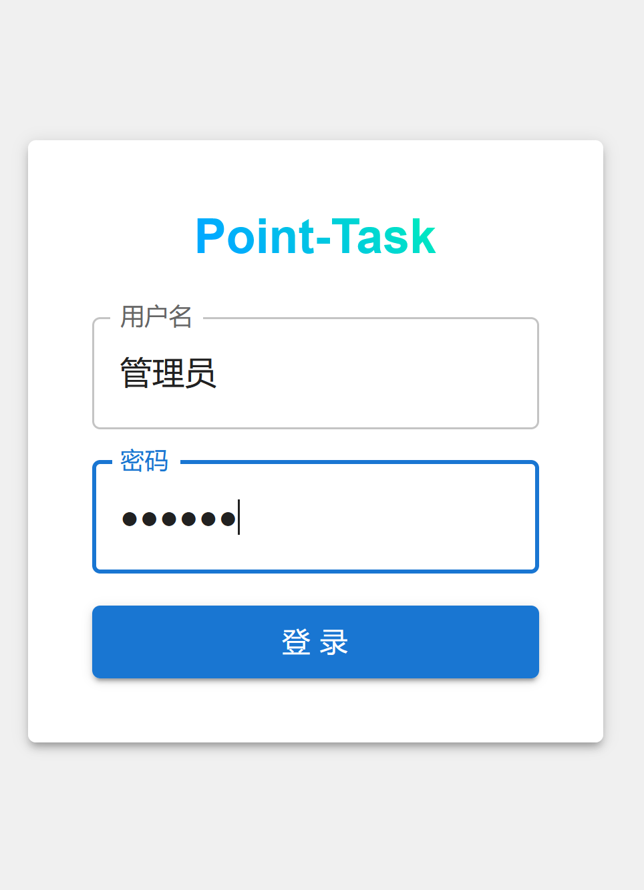

# Point-Task

简易的任务、奖励、积分管理系统。

适用于个人、小用户量场景。

## 技术栈

> 项目包含大量 AI 生成代码

- 前端：React + MUI + Vite
- 后端：Node.js + Express + TypeScript + Prisma
- 数据库：PostgreSQL
- 部署：Docker

## 功能

### 任务管理

### 任务详情（编辑/创建）

### 用户管理

### 用户登录

